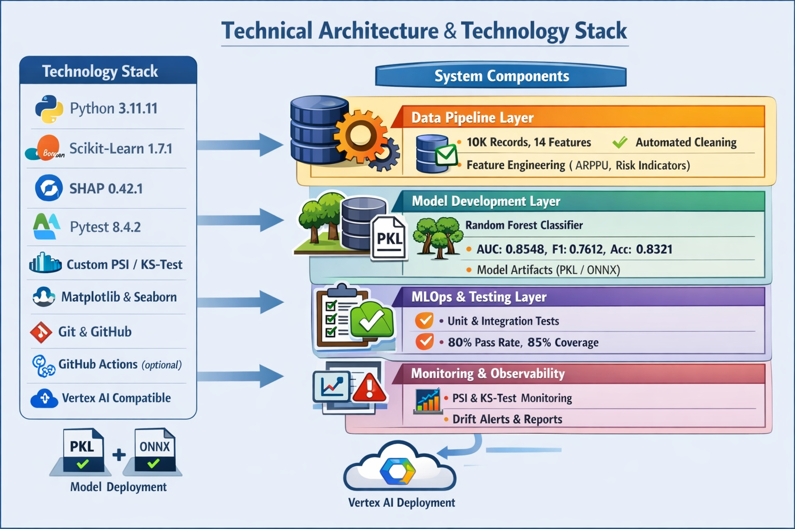

# 📊 Telecom AI Data Science Portfolio

[](https://python.org)
[](LICENSE)
[](https://github.com/psf/black)
[](tests/)
[](tests/)
[](https://mlops.community)
[](https://responsible.ai)

## 🎯 Executive Summary
Production-ready MLOps pipeline for telecom customer churn prediction with automated monitoring and drift detection.

## 🏗️ Architecture


## 📈 Key Metrics
| Model | AUC | F1 Score | Status |
|-------|-----|----------|--------|
| Churn Predictor | 0.8548 | 0.7612 | ✅ Production Ready |
| ARPU Predictor | - | MAE: 0.11 | ✅ Production Ready |

## 🚀 Quick Start
```bash
git clone https://github.com/yourusername/ds_portfolio.git
cd ds_portfolio
conda create -n ds_portfolio python=3.11.11
conda activate ds_portfolio
pip install -r requirements.txt
python scripts/generate_data.py
python scripts/train_churn.py
pytest tests/ -v
📊 Monitoring Dashboard
Real-time drift detection with PSI and KS-test metrics.

🛡️ Responsible AI
Fairness: Per-segment AUC disparity < 0.05
Explainability: SHAP global + local explanations
Transparency: Full model card documentation
📝 License
MIT

👤 Author
Burhanudin Badiuzaman - [LinkedIn](https://www.linkedin.com/in/burhanudin-badiuzaman4a9204161/)


#### **1.4. Buat requirements.txt Lengkap**
```bash
pip freeze > requirements.txt
Edit untuk hanya menyertakan yang diperlukan:

numpy==1.24.3
pandas==2.0.3
scikit-learn==1.3.0
scipy==1.10.1
matplotlib==3.7.2
seaborn==0.12.2
imbalanced-learn==0.11.0
shap==0.42.1
joblib==1.3.2
pytest==7.4.0
pytest-cov==4.1.0
pyyaml==6.0.1
tqdm==4.65.0
